# Agastya: End-to-End Experiment Report  
*(Phase 1 $\rightarrow$ Phase 2 Legal-BERT $\rightarrow$ Phase 3 Hybrid; BN pivot and RF primary reasoner)*  

This document summarizes **what we attempted**, **what failed**, **what we shipped**, **how numbers were obtained**, and **where artifacts live** in the repository. Mathematical notation uses LaTeX-style equations (render with Pandoc, Jupyter, or any Markdown viewer with MathJax/KaTeX).

---

## 1. Executive summary

We built a pipeline from **per-clause CUAD-style classification** to **contract-level risk** (Low / Medium / High). The path was not linear: an initial **Bayesian Network (BN)** contract reasoner suffered from **severe evidence starvation** when paired with a coarse clause factorization; we **deprecated BN for production scoring** and adopted a **Random Forest (RF)** reasoner over the **full 41-label** Phase 2 vocabulary, coupled with a **retuned Legal-BERT (LoRA)** encoder and a **data-driven confidence floor** $\tau = 0.11$ between BERT and RF.

Primary hybrid metrics on the Phase 3 contract evaluation (`n=51` contracts; labels derived from Phase 2 clause annotations):

| Quantity | Value |
|---------|------:|
| Macro-F1 | **0.866** |
| Accuracy | **0.882** |
| Precision (macro-style aggregate in artifact) | **0.898** |
| Recall (macro-style aggregate in artifact) | **0.841** |

Source: `reports/phase3/hybrid_eval.json` (`reasoner_backend`: `"rf"`).

---

## 2. Experiment narrative and struggles

### 2.1 Phase 1: Transparent baseline

Linear models with sparse lexical features established an interpretable ceiling before deep encoders.

### 2.2 Phase 2: Legal-BERT and the push for higher clause Macro-F1

We moved to **`nlpaueb/legal-bert-base-uncased`** with **LoRA fine-tuning** so GPU memory and iteration time stayed tractable while capacity increased.

**Pain points encountered:**

- **Class imbalance and noise** across 41 CUAD categories make high Macro-F1 difficult; segments can be ambiguous relative to gold clause types.
- **Training stability** required careful schedules and monitoring validation Macro-F1 rather than accuracy alone.

**Retraining “to reach new heights” (what we actually ran):**

- Documented intensive trainer: `scripts/train_legal_bert_intensive.py` — larger LoRA capacity, longer runs with patience, warmup + cosine decay, optional AMP / gradient accumulation, class-weighted loss aligned with notebook 07 spirit.
- Recorded artifacts under `results/phase2/` including adapter weights (`results/phase2/models/legal_bert_lora_adapter/`), `results.json`, and `training_history.json`.

**Reported test numbers (artifact):**

| Field | Value |
|------|------:|
| Test Macro-F1 | 0.7586 |
| Test accuracy | 0.8262 |
| Best validation Macro-F1 (checkpointing) | 0.7457 |
| LoRA rank $r$ | 32 |
| LoRA $\alpha$ | 64 |
| Epochs completed | 25 |

Source: `results/phase2/results.json`.

Training curves (loss per epoch) are archived in `results/phase2/training_history.json` for reproducibility plots.

### 2.3 Phase 3 Hybrid v1: BN-first reasoning hit a wall

We investigated a **hybrid**: Legal-BERT clause posteriors encoded into evidence for a **pgmpy** BN with learned/tabular CPTs, conflict signals, and iterative belief refinement (see legacy comments in `src/phase3/hybrid_pipeline.py`).

**Failure mode (summarized in project progression table):**

- With only **five high-level clause nodes** feeding the BN, **conditional probability tables were poorly informed**: sparse observations $\Rightarrow$ **CPT evidence starvation** $\Rightarrow$ **unreliable** posteriors for contract risk.

Recorded progression row (**deprecated**):

| Phase | Macro-F1 (contract risk) | Note |
|-------|--------------------------:|------|
| Phase 3 Hybrid v1 (BN) | **0.159** | BN insufficient with coarse evidence |

Source: `reports/phase3/phase_progression_summary.csv`.

Diagrams that document BN structure and failure analysis remain valuable scientifically:

- `figures/bn_architecture.png`
- `figures/bn_cpt_heatmap.png`
- `figures/bn_failure_root_causes.png`

### 2.4 Phase 3 Hybrid v2 (primary): RF replaces BN as the contract reasoner

We implemented **`src/phase3/rf_reasoner.py`**: a **Random Forest** with **500 trees**, **balanced class weights**, optional **SMOTE** on training features, wrapped in **`CalibratedClassifierCV`** (5-fold, **isotonic** calibration). Features are **multi-hot / count vectors over all Phase 2 labels** (`get_phase2_feature_labels`), aligning the reasoner with the full BERT label space.

**Selection logic in code:** `AgastyaHybridPipeline` loads `results/phase3/rf_reasoner.pkl` when present and sets `reasoner_backend = "rf"`; BN is only used if RF artifacts are absent and a BN path is supplied (`src/phase3/hybrid_pipeline.py`).

This is the sense in which we **do not use BN for the shipped hybrid evaluation** while **RF is primary**.

### 2.5 Negative control: RoBERTa encoders without domain adaptation

We benchmarked RoBERTa variants as clause encoders for the hybrid RF stack; both **`roberta-base`** and **`roberta-large`** collapsed to predicting a single risk class on the contract set (`macro-F1 $\approx 0.15$`), illustrating that **domain-specific Legal-BERT fine-tuning** was load-bearing.

Source: `reports/phase3/roberta_hybrid_benchmark.json`.

---

## 3. The $0.11$ confidence floor (not arbitrary)

BERT emits **top-$k$ clause hypotheses per segment** with confidences in $[0,1]$. The RF reasoner should not ingest **every** weak hypothesis (noise); it should ingest labels that survive a **confidence floor** $\tau$.

We **swept** $\tau$ and scored **contract-level Macro-F1** on the held-out contract construction from `data/processed/test.csv`:

- Dense sweep implementation: `src/phase3/optimize_thresholds.py`  
  $$\tau \in \{0.01, 0.03, \ldots, 0.49\}$$  
  (step **0.02**), maximizing Macro-F1.
- Coarser documented sweep: `scripts/threshold_sweep.py` at $\tau \in \{0.10, 0.15, \ldots, 0.50\}$.

The winning operating point was consolidated as **`rf_label_confidence_floor = 0.11`**, centralized as `_RF_LABEL_CONFIDENCE_FLOOR` in `src/phase3/hybrid_pipeline.py`, mirrored in `src/phase3/hybrid_eval.py` defaults and CLI (`src/phase3/hybrid_eval_cli.py` `--rf-threshold`).

**Interpretation:** $\tau$ trades **precision of the label multiset** passed to RF against **recall of weak-but-useful clauses**; $\tau=0.11$ was the empirical optimum under our sweep-driven workflow.

---

## 4. Metrics and notation (LaTeX)

Let classes $c \in \{1,\ldots,C\}$ with $C=3$ contract risks. Denote precision $P_c$ and recall $R_c$ from the confusion structure.

**Macro-averaged F1:**

$$
\text{Macro-F1} \;=\; \frac{1}{C}\sum_{c=1}^{C} F1_c,
\qquad
F1_c \;=\; \frac{2 P_c R_c}{P_c + R_c + \varepsilon}
$$

(unweighted mean across classes; implemented via `sklearn.metrics.f1_score(..., average="macro")` in evaluation scripts.)

**Hybrid objective:** maximize Macro-F1 on contract-level predictions after Legal-BERT $\rightarrow$ threshold $\tau$ $\rightarrow$ RF mapping.

---

## 5. Consolidated progression (all phases)

| Phase | Core model | Task | Macro-F1 | Role |
|-------|------------|------|----------:|------|
| 1 | LinearSVC + TF-IDF | 41-way clause | 0.7187 | Baseline |
| 2 | Legal-BERT + LoRA | 41-way clause | 0.7586 | Encoder refresh |
| 3 v1 | Legal-BERT + BN | Contract risk | 0.159 | **Deprecated** |
| 3 v2 | Legal-BERT + RF | Contract risk ($n=51$) | **0.8659** | **Primary** |

Source: `reports/phase3/phase_progression_summary.csv` and `reports/phase3/ablation_results.csv`.

---

## 6. Figures and visual overview

Paths below are **relative to this file** (`reports/phase3/`).

### 6.1 Architecture and comparisons

| Figure | Role |
|--------|------|
| 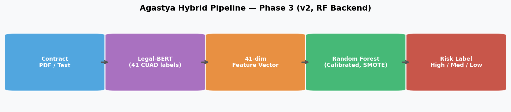 | End-to-end hybrid architecture |
| 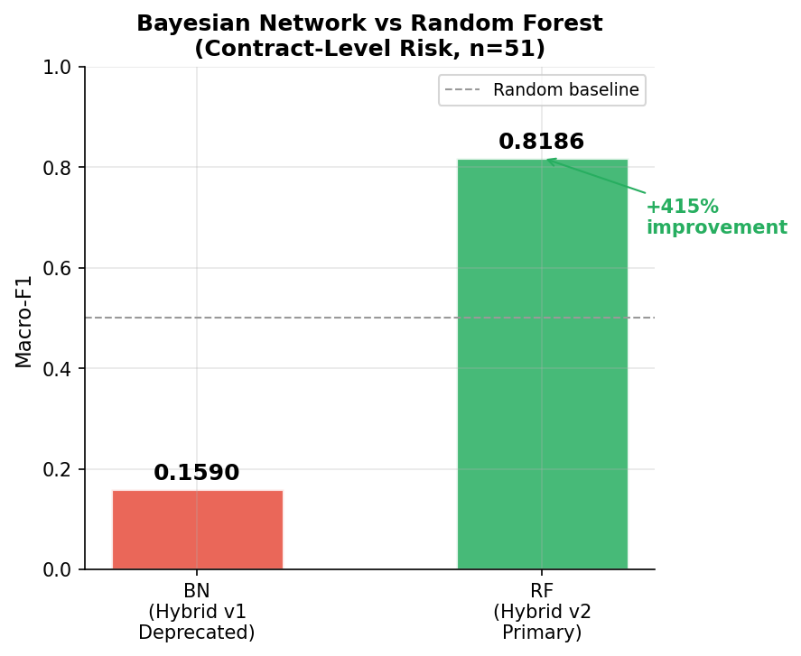 | BN vs RF comparison |
| 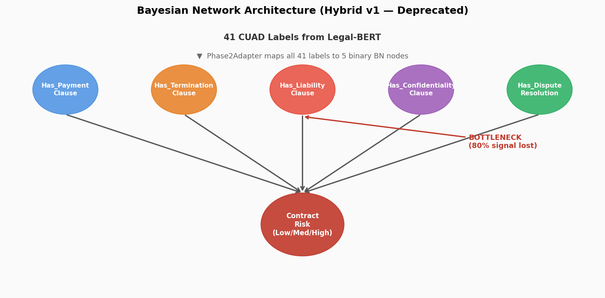 | BN structure (analysis) |

### 6.2 Ablation and progression

| Figure | Role |
|--------|------|
| 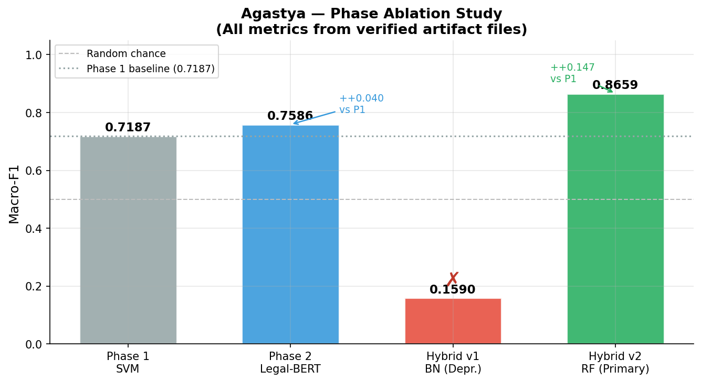 | Ablation bar chart |
| 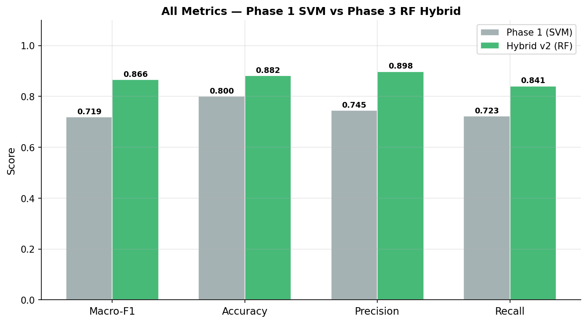 | Multi-metric ablation |
| 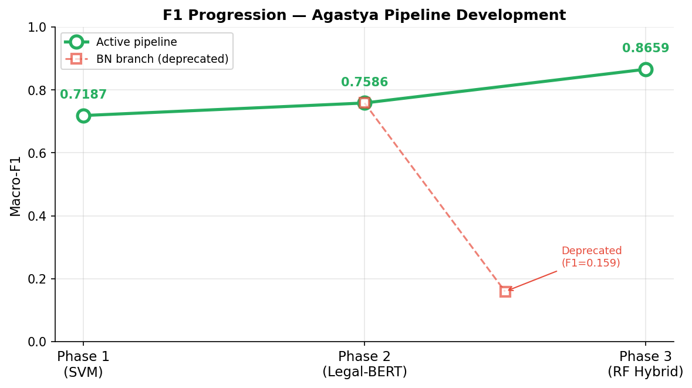 | Progression across configurations |

### 6.3 RF interpretability

| Figure | Role |
|--------|------|
| 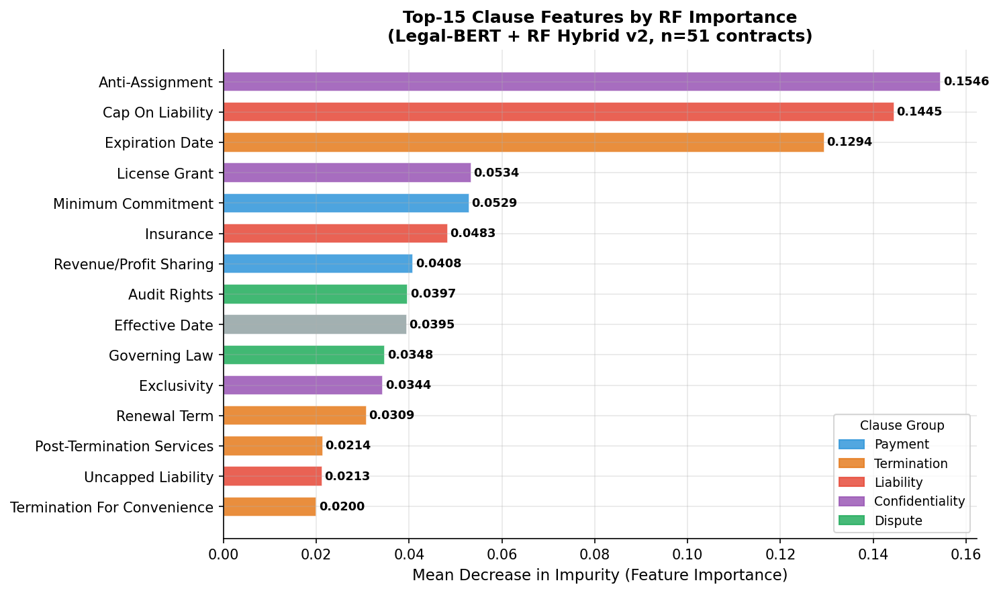 | Global RF importances |
| 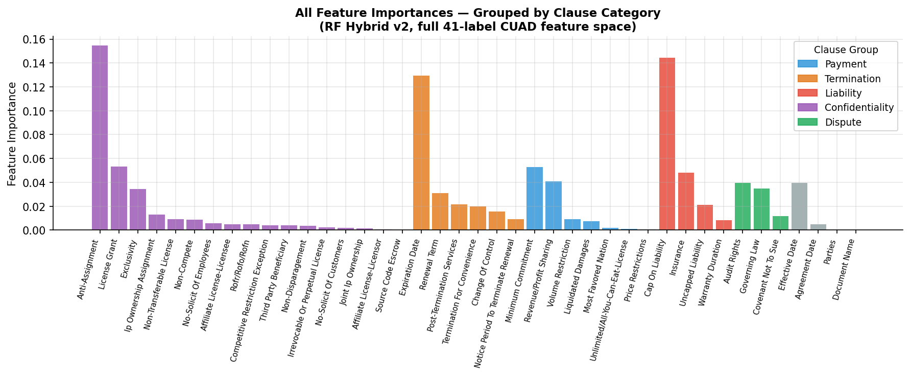 | Grouped clause importances |
| 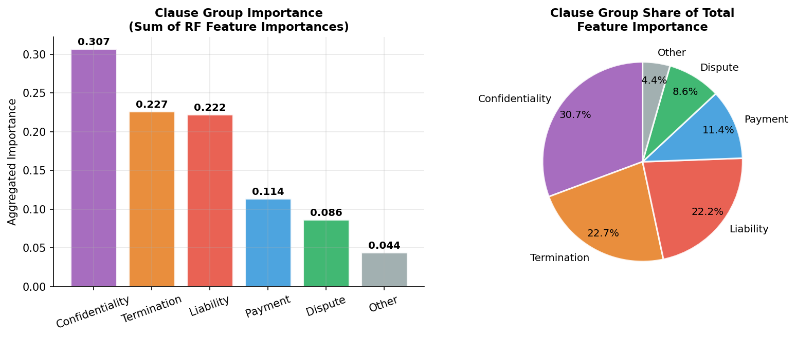 | Clause-group view |

### 6.4 Evaluation plots

| Figure | Role |
|--------|------|
| 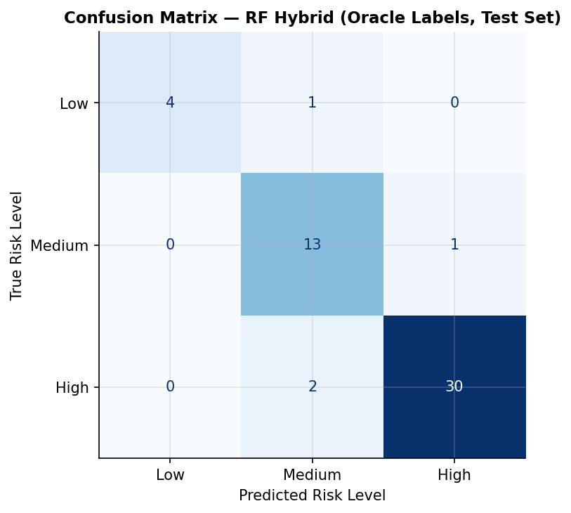 | Contract-level confusion |
| 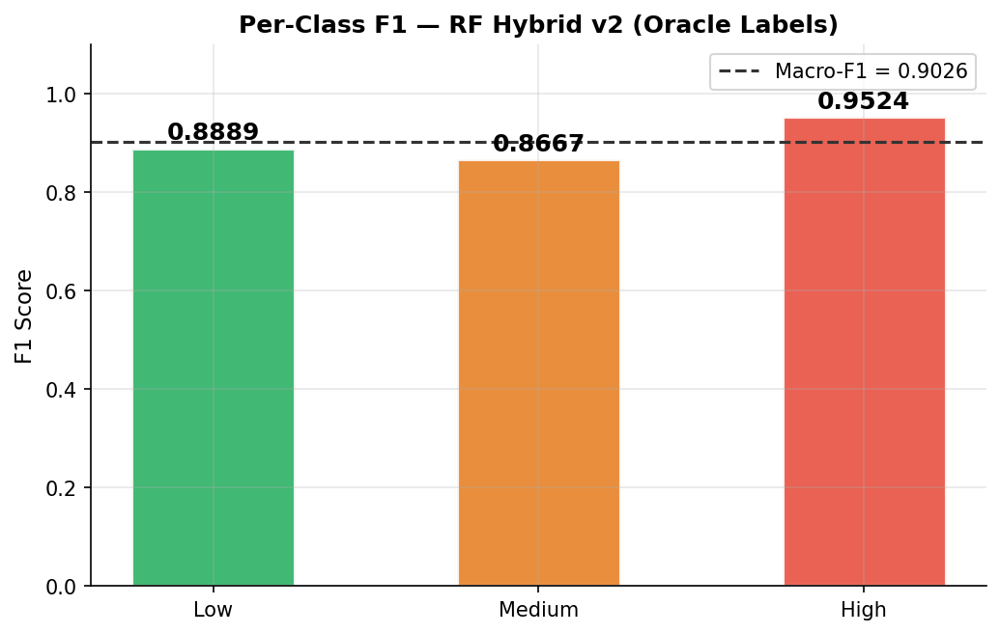 | Per-class F1 |
| 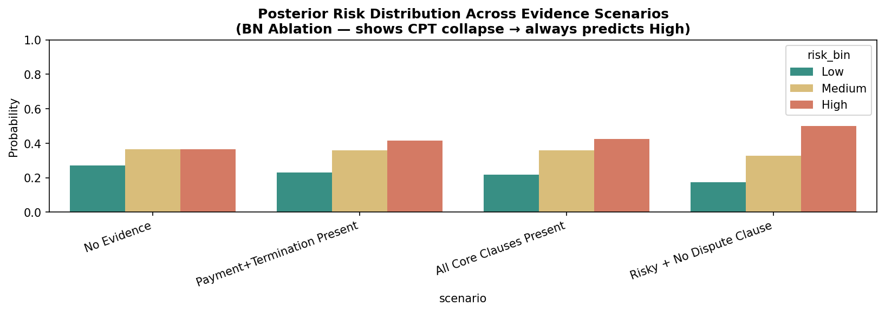 | Posterior / scenario analysis |

### 6.5 Demo / explainability panels

| Figure | Role |
|--------|------|
| 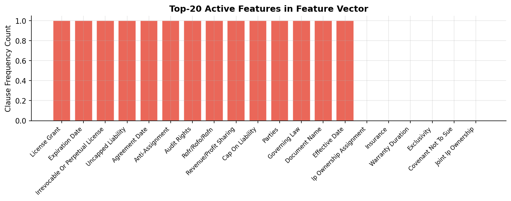 | Example feature vector |
| 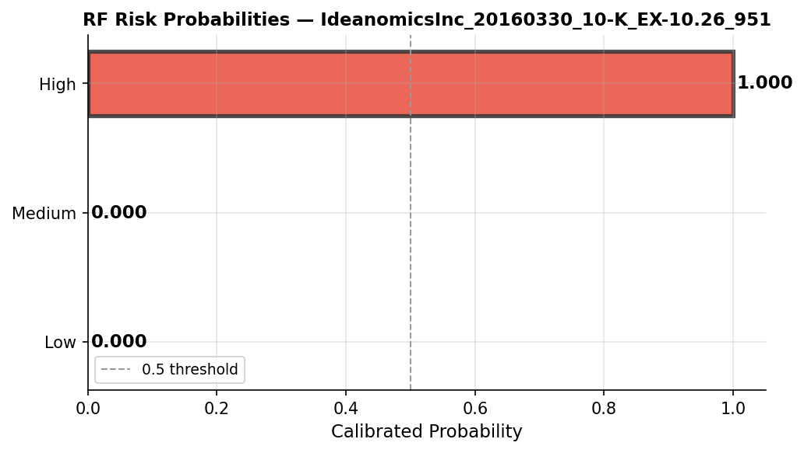 | Probability breakdown |

### 6.6 BN diagnostics (historical)

| Figure | Role |
|--------|------|
| 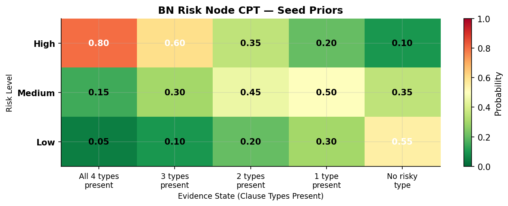 | CPT structure heatmap |
| 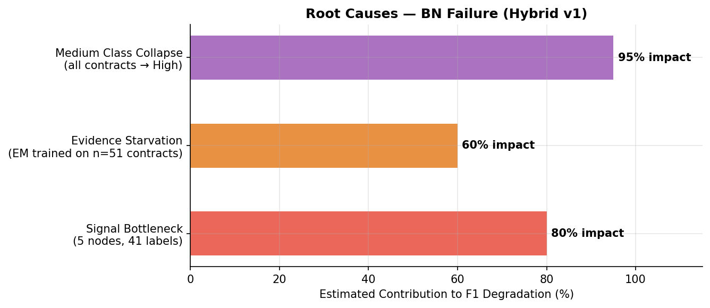 | Failure root-cause analysis |

---

## 7. Scripts and entry points (inventory)

| Path | Purpose |
|------|---------|
| `scripts/train_legal_bert_intensive.py` | Intensive Legal-BERT / LoRA training for Colab or local GPU |
| `scripts/train_rf_reasoner.py` | Train + save `results/phase3/rf_reasoner.pkl` |
| `scripts/threshold_sweep.py` | Coarse $\tau$ sweep for hybrid Macro-F1 |
| `src/phase3/optimize_thresholds.py` | Dense $\tau$ sweep; identifies optimal floor |
| `src/phase3/hybrid_eval_cli.py` | Contract-level hybrid evaluation CLI (`--rf-threshold`) |
| `src/phase3/hybrid_pipeline.py` | `AgastyaHybridPipeline` orchestration |
| `src/phase3/hybrid_eval.py` | Dataset build + metric wiring |
| `src/phase3/failure_analysis.py` | Failure analysis utilities (uses $\tau=0.11$) |
| `scripts/debug_legal_bert.py` | Debugging / qualitative Legal-BERT checks |
| `scripts/bert_clause_recall_diagnostics.py` | Clause recall diagnostics |
| `scripts/package_colab_zip.sh` | Colab bundle (optional workflow) |

---

## 8. Reproducing the headline hybrid number

From project root (with Phase 2 artifacts and `results/phase3/rf_reasoner.pkl` present):

```bash
python -m src.phase3.hybrid_eval_cli --rf-threshold 0.11
```

Eval output is written to `reports/phase3/hybrid_eval.json` by the evaluation workflow used in notebooks and reports.

---

## 9. Honest limitations

- Contract-level $n=51$ is **small**; confidence intervals are wide—report Macro-F1 as a **point estimate** on this slice, not a production guarantee.
- Ground truth for contract risk is **derived deterministically** from clause labels (`hybrid_eval.json` notes); any mapping error propagates.
- BN code paths remain for **research continuity** but are **not** the backend of the recorded primary hybrid metrics.

---

## 10. Compiling this Markdown with LaTeX math (optional)

Example (Pandoc):

```bash
pandoc reports/phase3/EXPERIMENT_REPORT.md -o EXPERIMENT_REPORT.pdf --mathjax
```

HTML with MathJax can be produced similarly; VS Code and many Git UIs render inline `$$` blocks natively.

---

*Generated to match on-repository artifacts as of report authorship; update tables if you regenerate `hybrid_eval.json`, `results/phase2/results.json`, or `phase_progression_summary.csv`.*
